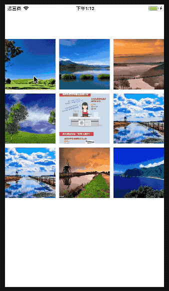

# react-native-sf-image-zoom-viewer

# 图片查看器，支持手势缩放、分享



# 安装
> npm install react-native-sf-image-zoom-viewer
> npm install react-native-video
> npm install react-native-md5
> react-native link react-native-video
# 例子
```
import React, {Component} from 'react';
import {
    Platform,
    StyleSheet,
    Text,
    View,
    TouchableWithoutFeedback,
    ScrollView,
    findNodeHandle,
    Dimensions,
    Image
} from 'react-native';
import {SFZoomView, SFZoomViewConfig} from 'react-native-sf-image-zoom-viewer'
import {UIManager} from 'NativeModules';
var dw = Dimensions.get('window').width;
var dh = Dimensions.get('window').height;

type
Props = {};
export default class App extends Component<Props> {
    click = (index) => {
        this.zoom.show(index);
    }
    render_imgs = () => {
        var imgs = []
        let column = 3;
        let itemWidth = (dw - (10 * column - 10)) / column;
        for (var i = 0; i < this.dataSource.length; i++) {
            var img = this.dataSource[i].path;
            if (typeof(this.dataSource[i].path) == 'string') {
                img = {uri: this.dataSource[i].path}
            }
            imgs.push(
                <TouchableWithoutFeedback key={i} onPress={this.click.bind(this, i)}>
                    <Image ref={'img_' + i} style={{
                        width: itemWidth,
                        height: itemWidth,
                        marginTop: 10
                    }} source={img}></Image>
                </TouchableWithoutFeedback>
            )
        }
        return imgs;
    }

    render() {
        return (
            <View style={{
                flex: 1,
                backgroundColor: 'white',
            }}>
                <View style={{
                    flex: 1,
                    flexDirection: 'row',
                    flexWrap: 'wrap',
                    alignItems: 'flex-start',
                    justifyContent: 'space-between',
                    marginTop: 80
                }}>
                    {this.render_imgs()}
                </View>
                <SFZoomView ref={(ref)=> {
                    this.zoom = ref
                }}/>

            </View>
        )
    }

    componentWillMount() {

        this.dataSource = [
            {
                path: 'http://imgsrc.baidu.com/imgad/pic/item/cdbf6c81800a19d8a1af34d139fa828ba71e46b1.jpg',
                type: SFZoomViewConfig.ZOOM_TYPE_IMG
            },
            {
                path: 'http://img1.imgtn.bdimg.com/it/u=1777558445,2281514504&fm=200&gp=0.jpg',
                type: SFZoomViewConfig.ZOOM_TYPE_IMG
            },
            {
                path: 'http://image.pearvideo.com/cont/20170525/cont-1084591-10337967.jpg',
                type: SFZoomViewConfig.ZOOM_TYPE_VIDEO,
                video_path: 'http://video.pearvideo.com/mp4/short/20170525/cont-1084591-10484983-sd.mp4'
            },
            {
                path: 'http://img2.imgtn.bdimg.com/it/u=2610705528,1626175376&fm=200&gp=0.jpg',
                type: SFZoomViewConfig.ZOOM_TYPE_IMG
            },
            {
                path: 'https://timgsa.baidu.com/timg?image&quality=80&size=b9999_10000&sec=1523263263604&di=3a8cf59260058fbc40f36330900fd2cc&imgtype=jpg&src=http%3A%2F%2Fimg4.imgtn.bdimg.com%2Fit%2Fu%3D2779393999%2C2850222965%26fm%3D214%26gp%3D0.jpg',
                type: SFZoomViewConfig.ZOOM_TYPE_LONG_IMG
            },
            {
                path: 'http://img3.imgtn.bdimg.com/it/u=594996916,636240317&fm=200&gp=0.jpg',
                type: SFZoomViewConfig.ZOOM_TYPE_IMG
            },
            {
                path: 'http://img3.imgtn.bdimg.com/it/u=594996916,636240317&fm=200&gp=0.jpg',
                type: SFZoomViewConfig.ZOOM_TYPE_IMG
            },
            {
                path: 'http://img0.imgtn.bdimg.com/it/u=2257366377,1526496951&fm=200&gp=0.jpg',
                type: SFZoomViewConfig.ZOOM_TYPE_IMG
            },
            {
                path: 'http://img1.imgtn.bdimg.com/it/u=3836562103,1802124562&fm=200&gp=0.jpg',
                type: SFZoomViewConfig.ZOOM_TYPE_IMG
            },
        ]


    }

    componentDidMount() {
        var ds = [];
        for (var i = 0; i < this.dataSource.length; i++) {
            var handel = findNodeHandle(this.refs['img_' + i]);
            var subData = this.dataSource[i];
            var data = {
                big_path: subData.path,
                small_path: subData.path,
                type: subData.type,
                ctrHandel: handel,
                video_path: subData.video_path
            }
            ds.push(data);
        }
        this.zoom.init(ds);
    }
}

```

# Props
|  parameter  |  type  |  required  |   description  |  default  |
|:-----|:-----|:-----|:-----|:-----|
|isShowAni|boolean|no|是否显示展示动画|true|
|isShowShare|boolean|no|是否显示分享按钮|true|
|onShare|function<br>()=>(index)=>{}|no|点击分享事件|()=>null|
